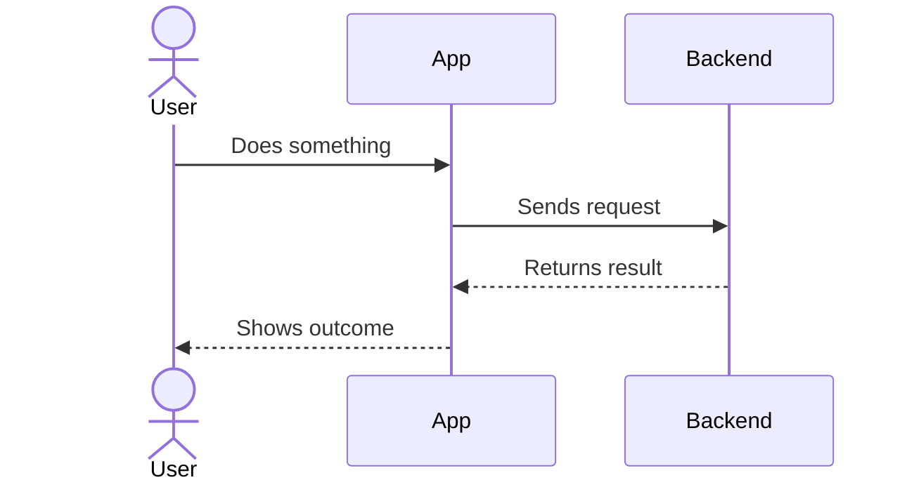

# User Journey Map

> Walk through the experience step-by-step. One person drafts the happy path. Partner adds pain points, edge cases, and alternate paths.

---

## Journey 1: Sam (freelance designer) — First-time setup and receipt capture

| Step | User Action | System Response | User Feeling | Pain Points / Questions |
|------|-------------|-----------------|--------------|------------------------|
| 1 | Downloads app from App Store | Onboarding screen: "Get tax-ready in 5 minutes" | Curious, slightly skeptical | Will this actually be different? |
| 2 | Signs up with email | Account created, asks to connect bank | Willing but cautious | "Is this safe?" — need trust signals |
| 3 | Connects bank via Open Banking | TrueLayer auth flow, transactions start syncing | Impressed by speed | OAuth redirect feels unfamiliar |
| 4 | Sees last 30 days of transactions | Feed of transactions, many unmatched | Interested but overwhelmed | Too many items at once? |
| 5 | Takes photo of a coffee shop receipt | AI parses: "Costa Coffee, £4.50, Apr 10" | Delighted — it actually works | What if the photo is blurry? |
| 6 | App suggests a matching bank transaction | "Match this to: COSTA STORES £4.50 Apr 10?" | Satisfied — this is the magic moment | What if it suggests wrong match? |
| 7 | Swipes to confirm match | ✅ Matched. Category auto-set to "Food & Drink" | Feels productive | Wants to do more |
| 8 | Checks tax dashboard | Shows £340 in expenses this quarter, 15% ready | Motivated to keep going | "Ready" % feels low — discouraging? |

### Sequence Diagram

### Edge Cases & Alternate Paths

_What happens when things go wrong or the user does something unexpected?_

| Trigger | What happens | How we handle it |
|---------|-------------|-----------------|
| Blurry receipt photo | AI can't parse reliably | Show "We couldn't read this clearly — try again or enter manually" |
| No matching bank transaction | Receipt has no corresponding charge (cash, personal card) | Let user mark as "cash expense" or "skip" |
| Duplicate receipt | User photographs same receipt twice | Detect duplicate by amount + date + vendor, prompt "Already captured?" |
| Bank connection drops | TrueLayer token expires or bank revokes access | Notify user, offer to reconnect, keep local data intact |

---

<!-- Copy the journey template above for additional personas or flows. -->

<!--
## Journey 2: [User Persona] — [Goal]
...
-->
