# STACK Plan — First Vertical

> **Working name:** Front Door STACK *(provisional — alternatives: Client Inbox, Inbound, Client Channel)*
>
> **Scope:** Document Intake + Customer Support, delivered as a single STACK because that is how the SMB experiences both: one stream of stuff arriving, one team trying to handle it, one client wanting a response.
>
> **Architectural posture:** the STACK is a **configurable substrate plus a deployment configurator**, not a library of pre-built vertical packs. The first deployment is a legal firm; the architecture is vertical-agnostic, and the proof point is how cheaply the second and third deployments — in different verticals — go live.

---

## 1. Why combine Document Intake + Customer Support

The reach.md catalogue treats Document Intake and Customer Support as separate verticals. From an architectural standpoint that is clean. From the SMB's standpoint it is artificial.

A 25-person legal firm, a five-broker insurance shop, an 80-employee migration agent — each of them experiences inbound work as one stream:

- A client emails three PDFs and asks "have you got everything you need?"
- A new lead fills the website form and attaches a quote.
- A regulator sends a letter that has to be classified, filed, *and* responded to.
- A returning customer messages "what's the status of my claim?" — answering needs both a knowledge lookup and a document lookup.

Splitting these into "documents" and "tickets" forces the SMB to operate two consoles, two queues, two sets of metrics, and two implementation projects. SMBs do not have the staff or attention budget for that.

**Combined framing:** every piece of inbound traffic — document, message, form, attachment, voicemail transcript — hits the same Front Door, gets classified into "what is this and what engagement does it belong to," and is routed to one of three outcomes: filed automatically, drafted for human approval, or escalated.

The two flows share roughly 70% of their substrate. The 30% that differs is additive rather than parallel. Building them together costs about 1.3x what building one would, and prices like a richer single product instead of two thin ones.

---

## 2. The STACK as configurable substrate

The most important design decision in this plan: **build a configurator that bootstraps a deployment from buyer history, rather than a library of hand-crafted vertical packs.**

A reasonable engineer would look at reach.md's three verticals (Document Intake, Customer Support, HR) and conclude that the team should build three vertical packs — three ontologies, three connector inventories, three eval suites. That is the wrong shape. Three reasons:

- **AU SMBs use weird stacks.** No team will ever build a first-class connector for every PMS / CRM / ERP / shared-drive / forms-tool combination an SMB has cobbled together. Vertical-pack thinking always leaves the consultant blocked at the first SMB whose stack doesn't match the assumptions.
- **Vertical packs lock in one shape and re-start at the next vertical.** The fourth vertical (say, allied health practice management) is roughly as expensive as the first if the IP is shaped as packs. The fourth vertical should be cheap.
- **The defensibility flywheel is stronger under a configurator.** Every deployment teaches the configurator — patterns, taxonomy fragments, eval failure modes, adapter quirks. The accumulated tooling is harder to reproduce than a hand-coded legal ontology would be.

What the STACK ships:

| Layer | What's universal | What's per-deployment |
|-------|-----------------|----------------------|
| Ontology | Small **universal core** (party, engagement, document, message, reference, obligation, person, amount) | Specialised at deploy time by the **ontology generator** from buyer history |
| Integrations | **Universal adapter set** covering email, web, generic API, webhook, file, CSV, browser, iPaaS, MCP | Adapter wiring + selective **first-class connectors** built when deployment frequency justifies it |
| Classification + extraction | Few-shot model wrappers + active-learning loop | Labelled examples generated from buyer history during configuration |
| Eval pack | Universal scaffolding + accumulated failure-mode library | Golden set curated from buyer's last 6–12 months of work |
| Cockpit + portal | Reach-built, themable | SMB branding, vocabulary, escalation rules, tone profile |
| Guardrails / observability / audit | Universal — PII detection, redaction primitives, residency controls, action permissions, audit trail format | Sectoral overlays (legal trust accounting, health PHI, migration MARA), retention rules, sub-processor disclosures |
| Compliance posture | Three modes (Standard / Restricted / Air-gapped) and the policy primitives for each — see §11 | Mode selection + approved sub-processors + sensitive-data scope captured by the configurator |

What stays vertical-aware: the **consultant** brings vertical judgment to the configurator (sees the proposed ontology, knows what a fee earner is, knows what a claim ID looks like, accepts/refines/rejects), and the deployment pattern library accumulates per vertical from real deployments. The STACK does not need vertical knowledge baked into the binary.

---

## 3. What it is

Two surfaces visible to the SMB and their clients, sitting between the SMB's existing tools and their staff:

| Surface | Who uses it | What they do there |
|---------|-------------|--------------------|
| **Staff cockpit** | SMB staff (the 1–10 people who actually do the work) | Review the queue, approve drafts, correct misclassifications, see audit trails, watch quality metrics. |
| **Client portal** | The SMB's clients / customers | Upload documents, ask questions, see the status of their engagement, get a branded experience that feels like the SMB built it. |

Behind those surfaces sit the substrate components from §2 plus a deployment-specific configuration layer the consultant builds in CORE.

The STACK does not try to be a CRM, a helpdesk, a practice-management tool, or a document store. The SMB already has those — usually three of each, half-configured. The STACK is the layer that makes them useful together.

---

## 4. What it does

Six daily moments for SMB staff. Everything else is supporting infrastructure for these.

### 4.1 Inbound triage

Anything arriving from a client — email, attachment, form submission, portal upload, helpdesk ticket, transcribed call — is classified within seconds:

- **Type:** is this a new engagement, an existing one, a status request, a complaint, a compliance document, marketing noise?
- **Engagement link:** which existing record does this belong to, or does a new one need to be created?
- **Urgency:** does this need an owner today, or is it routine?
- **Completeness:** does it stand alone, or is the client missing something they need to send?

The output is a structured row in the cockpit queue with a confidence score, a suggested engagement, and a suggested next action.

### 4.2 Document extraction and filing

For inbound documents, the STACK extracts the typed entities the deployment ontology specifies — parties, dates, amounts, references, identifiers — and writes them back to the SMB's system of record with the right metadata. Above the confidence threshold, the file lands where it belongs without staff touching it. Below threshold, it sits in the cockpit for one-click confirmation.

### 4.3 Draft response

For inbound messages, the STACK drafts a response grounded in the SMB's knowledge base, past responses to similar questions, and the engagement context. Tone is configured per SMB. The draft sits in the cockpit for staff to send, edit, or reject.

For some categories (delivery status, simple FAQ, appointment confirmation) the SMB can opt-in to autonomous reply once the eval pack shows it is safe.

### 4.4 Missing-information chase

When the ontology's completeness rules detect that an engagement is missing something — a signed letter, an ID scan, a declaration page, a tax file number — the STACK drafts the follow-up to the client, queues it for staff approval, and tracks the response. This is the single feature that produces the most "this earned its keep" moments in a typical week.

### 4.5 Status answering

When a client asks "where are we up to," the STACK answers from the engagement graph rather than from staff memory. The branded portal lets the client self-serve. The cockpit shows the same view to staff so they can answer when the client phones instead of clicking.

### 4.6 Escalation and exception

Anything the STACK cannot confidently handle surfaces as an escalation with the relevant evidence attached. Staff resolve it; the resolution feeds back into the eval pack and, where appropriate, into the deployment ontology and the configurator's pattern library.

---

## 5. Where the SMB actually lives

The sales pitch sounds clean. The reality on the ground is not. Every AU SMB in the buyer profile has roughly this stack, at roughly this level of disrepair:

| Layer | What's actually there | State |
|-------|----------------------|-------|
| Email | Microsoft 365 or Google Workspace, with a shared inbox or two | Authoritative, overflowing, no folder discipline |
| Practice management | Xero / MYOB / Karbon / FYI / LEAP / Smokeball / ActionStep / Migration Manager / Cliniko / etc. | Configured years ago, partially adopted, two people understand it |
| Storage | Google Drive, OneDrive, SharePoint, Dropbox — often more than one | Folder taxonomy made sense to one person who has since left |
| Helpdesk | Maybe Zendesk / Freshdesk / Help Scout, often just a shared inbox or a Gmail label | Triage is "whoever sees it first" |
| Knowledge base | A Google Doc called "FAQs" last edited 14 months ago, plus three Notion pages, plus an internal wiki nobody opens | Out of date by definition |
| Spreadsheets | Client lists, status trackers, fee schedules, "who's doing what," compliance checklists | Source of truth for whichever process the PM tool didn't cover |
| Loose docs | Letter templates, response templates, SOPs in Word, signed PDFs scattered across email | Authoritative when found, undiscoverable otherwise |
| Tribal knowledge | The 1–3 people who know how things actually work | The real KB |
| Comms | Slack or Teams or WhatsApp groups, often more than one | Decisions made here, never written down |

The STACK has to land here. Three integration principles follow from that.

### 5.1 Treat email as the primary surface

Every adapter matters, but email is the one that determines whether the deployment works at all. The shared inbox is where new engagements are born, where clients send things, where status questions arrive, and where staff respond. The email adapter (M365 + Google Workspace) is the first first-class connector and the one we maintain most carefully.

### 5.2 Read everything; trust selectively

Spreadsheets, FAQ docs, old email threads, and loose templates all get indexed. They are excellent context for retrieval and excellent fuel for draft responses. They are unreliable as sources of truth for structured data — the spreadsheet column called "status" might mean five different things depending on who last edited it. Our approach:

- **Index broadly** — ingest spreadsheets, Drive folders, Notion, the FAQ doc, past email threads, past helpdesk tickets, past responses.
- **Extract typed entities only from documents the deployment ontology recognises** — once the ontology generator has produced a schema, extraction is constrained to entities and fields that have been validated.
- **Write back only to the systems the SMB already trusts** — the PM system, the storage layer, the helpdesk. Never write to the spreadsheets — they are observation surfaces.

### 5.3 Capture tacit knowledge during configuration

The deployment console (CORE side) has to elicit the things the SMB's experts know but have not written down:

- "We always send the engagement letter before the costs disclosure."
- "Anything from this regulator goes straight to the partner."
- "If the trust ledger doesn't reconcile, do not auto-file — page Marie."
- "These five clients get a different tone."

This is where most generic AI tools fail at SMB scale. The configurator exposes this as a structured surface in CORE — vocabulary, escalation rules, tone profiles, exception lists — so the consultant can capture it once and the SMB does not have to teach the system three times.

### 5.4 What we deliberately do not fix

We do not reorganise the SMB's Drive. We do not reconfigure their PM system. We do not rebuild their FAQ. We do not change their email setup. We do not impose a new shared inbox structure. We do not migrate their helpdesk.

Each of those would double the engagement length and triple the change-management cost. The STACK has to deliver value on top of the mess.

---

## 6. Universal adapters and selective first-class connectors

The STACK's integration story is a **two-tier model**: a universal adapter set that covers any SMB stack at "good enough" fidelity, and a small library of first-class connectors built where deployment frequency justifies the investment.

### 6.1 Universal adapter set

These ship in v1 and cover almost every SMB tool in some form. They are what makes the STACK deployable into stacks the team has never seen.

| Adapter | Direction | Boundary | What it covers |
|---------|-----------|----------|----------------|
| Email-in / email-out | Read + write | In-tenant (OAuth in the SMB's M365 / Google tenant) | Any tool with an email address — and most SMB tools have one. Doubles as the email adapter. |
| Generic REST / GraphQL | Read + write | Egress by default; in-tenant when the API is hosted by the SMB | Any tool with an API; auth, schema, pagination, and rate limits configured per deployment in CORE. |
| Webhook receiver | Inbound | Egress (the source pushes to a Reach endpoint) | Any tool that can push events. Avoids polling. |
| File watcher | Read + write | In-tenant (runs against drives the SMB controls) | Drives, FTP, S3, anything with a watchable folder or sync target. |
| CSV / spreadsheet bridge | Read-only | In-tenant (sheets in the SMB's Drive / SharePoint) | The "we keep it in a Google Sheet" reality. Tabular content only; never writes back. |
| Browser automation (Playwright behind config) | Read + write | Egress (acts on external SaaS surfaces) | Tools with no API at all. Slow, fragile, covers the gap. |
| iPaaS bridge (Zapier / Make / n8n) | Bidirectional | Egress (data flows through the iPaaS provider) | Fallback to the SMB's existing automation stack. |
| MCP server consumer | Bidirectional | Either — MCP servers can be hosted in the SMB's tenant or consumed as remote SaaS; placement determines the privacy posture | Standard protocol (Anthropic, late 2024) that an AI client uses to read resources and invoke tools. A growing list of SMB-relevant tools ship MCP servers — Notion, Slack, Google Drive, GitHub, Atlassian, Linear, Asana, Zapier — and the catalogue is expanding fast. See §11.4 for the privacy implications. |

The "Boundary" column is load-bearing: every adapter declares whether the data path stays inside the SMB's tenant or crosses to a third-party endpoint. The compliance posture in §11 uses this metadata to decide which adapters are usable in which deployment.

**KB content is a content class, not a source.** FAQs, SOPs, templates, and policy material route through whichever adapter fits where the SMB happens to keep them: tabular KB through the CSV / spreadsheet bridge; Word / Google Docs / PDFs in storage through the File watcher; Notion / Confluence / wiki APIs through the Generic REST / GraphQL adapter or the MCP consumer. All KB content converges in the vector store for retrieval, regardless of route.

**The STACK as MCP provider.** The MCP relationship runs both ways. The STACK exposes itself as an MCP server too, so SMB staff running Claude Desktop, Cursor, or any future AI client that speaks MCP can query their own STACK directly. This converts a class of "build us a custom UI" requests into "point your existing AI tool at this MCP endpoint" — at zero marginal build cost.

The default deployment path for any SMB tool the team does not have a first-class connector for: **wire the universal adapter, capture the schema in CORE, configure mappings, ship.** Most SMB tools the consultant encounters can be served this way to "good enough" quality without the team writing new code.

### 6.2 First-class connectors

A first-class connector is built when one of these criteria is met:

- The tool appears in three or more active deployment scopes.
- The universal adapter coverage is materially worse than first-class would be (e.g. write-back integrity, schema discovery, error semantics).
- The tool has a write-back orchestration story the SMB depends on (e.g. opening a new matter in LEAP with the right fields populated, posting a journal in Xero with the right account mappings).

First-class connectors at v1:

- **Microsoft 365 mailbox** — read + write, including shared inboxes, send-as, threading, signatures, labels.
- **Google Workspace mailbox** — same for Google.
- **Reach client portal** — Reach-hosted upload + status + Q&A surface, themable per SMB.

Everything else starts as universal-adapter coverage and graduates to first-class only when the deployment data justifies it. The vertical-specific PM systems (LEAP, Xero, Karbon, Migration Manager, Cliniko, WinBeat, etc.) appear in this list as deployment frequency proves them, vertical by vertical.

### 6.3 What "integration" actually means

Three different things, often conflated:

- **Read-only ingest** — pull data in, do not write anything back. Cheapest. The default for spreadsheets, KB docs, past emails, and historical data.
- **Write-back** — push structured data into the SMB's system of record. More expensive per integration, more valuable per deployment. The default for email replies, document filing, and ticket responses.
- **Orchestration** — the STACK drives the next step in the SMB's workflow. Highest value, highest fragility, last to ship for any given tool.

Universal adapters cover read-only ingest broadly and write-back where the underlying API is clean. Orchestration is a first-class concern — it ships per tool, gated by the criteria above.

---

## 7. Architecture

```
                ┌────────────────────────────────────────────────────────┐
                │  CLIENT PORTAL (branded)        STAFF COCKPIT          │
                │  upload · status · Q&A          queue · review · audit │
                └──────────────┬──────────────────────────┬──────────────┘
                               │                          │
                ┌──────────────▼──────────────────────────▼──────────────┐
                │  REVIEW + APPROVAL                                      │
                │  drafts · escalations · approvals · feedback capture    │
                └──────────────┬──────────────────────────────────────────┘
                               │
                ┌──────────────▼──────────────────────────────────────────┐
                │  GENERATION                                             │
                │  draft response · extract entities · summarise · chase  │
                └──────────────┬──────────────────────────────────────────┘
                               │
                ┌──────────────▼──────────────────────────────────────────┐
                │  RETRIEVAL                                              │
                │  GraphRAG over deployment ontology · vector RAG over    │
                │  loose docs and historical messages                     │
                └──────────────┬──────────────────────────────────────────┘
                               │
                ┌──────────────▼──────────────────────────────────────────┐
                │  ONTOLOGY                                               │
                │  per-deployment ontology (specialised at config time)   │
                │  ─────────────────────────────────────────────────      │
                │  universal core: party · engagement · document ·        │
                │  message · reference · obligation · person · amount     │
                └──────────────┬──────────────────────────────────────────┘
                               │
                ┌──────────────▼──────────────────────────────────────────┐
                │  CLASSIFICATION + EXTRACTION                            │
                │  few-shot wrappers, configured per deployment from      │
                │  labelled buyer history; active-learning feedback loop  │
                └──────────────┬──────────────────────────────────────────┘
                               │
                ┌──────────────▼──────────────────────────────────────────┐
                │  INGEST                                                 │
                │  unified inbound queue across channels                  │
                └──────────────┬──────────────────────────────────────────┘
                               │
                ┌──────────────▼──────────────────────────────────────────┐
                │  ADAPTER FRAMEWORK                                      │
                │  universal adapters (email · web · API · webhook ·      │
                │  file · CSV · browser · iPaaS · MCP) + first-class      │
                │  connectors (M365 · Google · graduated as warranted)    │
                └─────────────────────────────────────────────────────────┘

           ╔═══════════════════════════════════════════════════════════╗
           ║  CONFIGURATOR (cross-cutting, runs at deploy time)         ║
           ║  ontology generator · extraction-schema generator ·        ║
           ║  adapter wiring · eval-pack scaffolding · golden-set       ║
           ║  curation · escalation-rule capture · tone profile         ║
           ║  ── operated by the consultant via CORE ──                 ║
           ╚═══════════════════════════════════════════════════════════╝
```

Cross-cutting concerns:

- **Guardrails** (PII detection, redaction, residency, action permissions) wrap the generation and write-back layers.
- **Eval harness** sits beside generation, runs on every output above a sample rate, and gates autonomous actions.
- **Observability** (metrics, logs, audit trail, drift detection) collects from every layer and feeds the cockpit, the consultant's CORE view, and the case-study generator.

Where the IP accumulates:

- **Substrate IP** (universal core ontology, adapter framework, configurator, eval harness, cockpit, portal) is shared across every deployment and improves with every release.
- **Pattern library IP** (ontology fragments, extraction schemas, eval failure modes, escalation patterns, tone profiles) accumulates from real deployments and feeds the configurator's defaults.
- **First-class connector IP** grows by selection — the team builds connectors the deployment data says are worth building.

### 7.1 Detailed component diagram

The diagram below names every component the team needs to build, its connections to the other components, and its connections to systems outside ReachStack (SMB tenants and AU-hosted inference providers). Boxes inside ReachStack subgraphs are what we build; boxes inside the SMB and Inference providers subgraphs are what we connect to.

```mermaid
flowchart TB
    %% ===== EXTERNAL: SMB end-client =====
    EndUser["SMB end-client<br/>(client / customer / patient / applicant)"]

    %% ===== EXTERNAL: SMB systems =====
    subgraph SMB["SMB systems &mdash; in their tenants, we connect"]
        direction LR
        Mailbox["M365 / Google Workspace<br/>mailbox + shared inbox"]
        Storage["Drive / OneDrive /<br/>SharePoint / Dropbox"]
        PM["PM systems<br/>LEAP, Xero, Karbon,<br/>Migration Manager, Cliniko, ..."]
        Helpdesk["Helpdesks<br/>Zendesk, Freshdesk,<br/>Help Scout"]
        Chat["Slack / Teams"]
        Forms["Web forms<br/>Typeform, Tally,<br/>website forms"]
        Sheets["Spreadsheets,<br/>FAQ docs, loose KB<br/>(in their Drive)"]
        SMBMCP["MCP servers in tenant<br/>Notion, Slack, custom"]
    end

    %% ===== STACK: surfaces =====
    subgraph SURFACES["ReachStack &mdash; Surfaces"]
        direction LR
        Cockpit["Staff cockpit<br/>(React, themed per SMB)"]
        Portal["Client portal<br/>(React, Reach-hosted, branded;<br/>no content leakage,<br/>no LLM training)"]
        STACKMCP["STACK as MCP server<br/>(SMB staff query via<br/>Claude Desktop / Cursor)"]
    end

    %% ===== STACK: adapter framework =====
    subgraph ADAPTERS["ReachStack &mdash; Adapter framework"]
        direction LR
        EmailA["Email adapter<br/>M365 + Google<br/>FIRST-CLASS"]
        APIA["Generic REST /<br/>GraphQL"]
        Webhook["Webhook receiver"]
        FileA["File watcher"]
        CSVA["CSV / spreadsheet"]
        BrowserA["Browser automation<br/>(Playwright)"]
        iPaaSA["iPaaS bridge<br/>(Zapier / Make / n8n)"]
        MCPA["MCP server consumer"]
    end

    %% ===== STACK: application =====
    subgraph APP["ReachStack &mdash; Application layer"]
        direction TB
        IngestQ["Unified inbound queue"]
        ClassifyExt["Classification + extraction<br/>(few-shot wrappers)"]
        Retrieve["Retrieval<br/>(GraphRAG + vector RAG)"]
        Generate["Generation<br/>(draft, extract,<br/>summarise, chase)"]
        ReviewApp["Review + approval<br/>(drafts, escalations,<br/>feedback capture)"]
    end

    %% ===== STACK: data =====
    subgraph DATA["ReachStack &mdash; Data layer (per deployment)"]
        direction LR
        UniOnto["Universal core ontology<br/>party · engagement · document ·<br/>message · reference · obligation ·<br/>person · amount"]
        DepOnto["Per-deployment ontology<br/>(specialised at config time)"]
        Graph["Graph store"]
        Vector["Vector store"]
        Object["Object / document store"]
        AuditS["Audit log store"]
    end

    %% ===== STACK: privacy & compliance =====
    subgraph SECURITY["ReachStack &mdash; Privacy & compliance (cross-cutting)"]
        direction TB
        Posture["Compliance posture engine<br/>Standard · Restricted · Air-gapped"]
        PII["PII detection + redaction<br/>universal: names, emails, phones, addresses<br/>AU: TFN, ABN, ACN, Medicare, ATO refs,<br/>Centrelink CRN, state licences, passport,<br/>immigration case IDs"]
        Router["Inference router<br/>(AU-hosted by default;<br/>offshore requires sign-off)"]
        Guard["Guardrails<br/>(action permissions,<br/>residency, send approvals)"]
        Audit["Audit trail logger<br/>(every inference + write-back)"]
    end

    %% ===== STACK: evals =====
    subgraph EVALS["ReachStack &mdash; Evals (always on)"]
        direction LR
        Harness["Eval harness<br/>(nightly + post-change)"]
        Golden["Golden set<br/>(per deployment,<br/>from buyer history)"]
        FailLib["Failure-mode library<br/>(cross-deployment, fed by<br/>every red-band incident)"]
    end

    %% ===== STACK: configurator =====
    subgraph CONFIG["ReachStack &mdash; Configurator (Phase 0 = JSON edits by founders; Phase 2+ = CORE UI)"]
        direction LR
        OntoG["Ontology generator"]
        SchemaG["Extraction-schema<br/>generator"]
        Wire["Adapter wiring"]
        EvalSeed["Eval-pack scaffolding"]
        PostCap["Compliance posture<br/>capture"]
    end

    %% ===== EXTERNAL: inference providers =====
    subgraph INFER["Inference providers &mdash; AU-hosted, contractually exclude customer data from training"]
        direction LR
        Anth["Anthropic via<br/>AWS Bedrock<br/>(Sydney, ap-southeast-2)"]
        Azure["Azure OpenAI<br/>(Australia East)"]
        Self["Self-hosted<br/>Llama / Mistral<br/>(AU infrastructure)"]
    end

    %% ===== End-user → SMB =====
    EndUser -->|emails + attachments| Mailbox
    EndUser -->|fills form| Forms
    EndUser -->|tickets| Helpdesk
    EndUser -->|uploads, status questions| Portal

    %% ===== Adapters ↔ SMB =====
    Mailbox <-->|OAuth, in-tenant| EmailA
    Storage <-->|in-tenant| FileA
    PM <-->|API auth| APIA
    Helpdesk <-->|API auth| APIA
    Chat <-->|read + post| APIA
    Forms -->|push| Webhook
    Sheets -->|read-only| CSVA
    PM -.->|when no API| BrowserA
    SMBMCP <-->|MCP protocol| MCPA
    Helpdesk -.->|fallback| iPaaSA

    %% ===== Adapters → Ingest =====
    EmailA --> IngestQ
    APIA --> IngestQ
    Webhook --> IngestQ
    FileA --> IngestQ
    CSVA --> IngestQ
    BrowserA --> IngestQ
    iPaaSA --> IngestQ
    MCPA --> IngestQ

    %% ===== Application flow =====
    IngestQ --> Object
    IngestQ --> ClassifyExt
    ClassifyExt --> DepOnto
    ClassifyExt --> Graph
    ClassifyExt --> Retrieve
    Retrieve --> Graph
    Retrieve --> Vector
    Retrieve --> Generate
    Generate --> ReviewApp
    ReviewApp --> Cockpit
    ReviewApp --> Portal
    ReviewApp --> STACKMCP

    %% ===== Write-back =====
    ReviewApp -->|approved replies| EmailA
    ReviewApp -->|file documents| FileA
    ReviewApp -->|update records| APIA

    %% ===== Data =====
    UniOnto --> DepOnto

    %% ===== Security wraps generation + classification =====
    Generate -.->|payload + context| PII
    ClassifyExt -.->|payload| PII
    PII -.->|tokenised| Router
    Router -.->|frontier draft| Anth
    Router -.->|frontier draft| Azure
    Router -.->|classify, extract| Self
    Anth -.->|response| Router
    Azure -.->|response| Router
    Self -.->|response| Router
    Router -.->|tokens| PII
    PII -.->|restored| Generate
    PII -.->|restored| ClassifyExt

    %% ===== Posture gates =====
    Posture ==>|gates| Router
    Posture ==>|gates egress adapters| ADAPTERS
    Posture ==>|gates auto-reply| ReviewApp

    %% ===== Guardrails =====
    Guard --> ReviewApp
    Guard --> ADAPTERS

    %% ===== Audit collects everywhere =====
    Router -.-> Audit
    PII -.-> Audit
    ReviewApp -.-> Audit
    EmailA -.-> Audit
    APIA -.-> Audit
    FileA -.-> Audit
    Audit --> AuditS
    AuditS --> Cockpit

    %% ===== Evals =====
    Generate -.->|sample outputs| Harness
    ClassifyExt -.->|sample outputs| Harness
    Harness -.->|active learning| Generate
    Harness -.->|active learning| ClassifyExt
    Harness <--> Golden
    Harness <--> FailLib
    Harness --> Cockpit

    %% ===== Configurator outputs =====
    OntoG ==>|generates| DepOnto
    SchemaG ==>|generates| ClassifyExt
    Wire ==>|configures| ADAPTERS
    EvalSeed ==>|seeds| Golden
    PostCap ==>|sets| Posture

    %% ===== Configurator inputs from buyer history =====
    Object -.->|history sample| OntoG
    Object -.->|history sample| SchemaG
    Object -.->|history sample| EvalSeed

    %% ===== Styling =====
    classDef external fill:#f5f5f5,stroke:#999,stroke-width:1px,color:#222
    classDef firstclass fill:#fef3c7,stroke:#b45309,stroke-width:2px
    class EndUser,Mailbox,Storage,PM,Helpdesk,Chat,Forms,Sheets,SMBMCP,Anth,Azure,Self external
    class EmailA,Cockpit,Portal firstclass
```



**Legend.**
- Solid arrow `→` — primary runtime data flow.
- Dotted arrow `⇢` — cross-cutting wrap (PII pipeline, inference router, audit, evals, configurator history sampling).
- Thick arrow `⇒` — configurator-time relationship: this configurator component generates / configures / seeds the target.
- Bidirectional arrow `↔` — adapter that reads and writes (or, in the case of MCP, the protocol's request/response).
- Yellow-bordered boxes — first-class items (the M365/Google email adapter, the staff cockpit, the client portal — these get hand-built quality, everything else is universal-adapter quality by default).
- Grey-filled boxes — external systems we connect to (SMB tenants, inference providers); everything else is what we build and host.

**What the diagram makes precise.**
- Every adapter feeds the same unified inbound queue; there is exactly one ingest path regardless of channel.
- Every payload that leaves the application layer for inference passes through the PII redaction pipeline first and the inference router second; the application layer never talks directly to a frontier endpoint.
- The compliance posture engine is the single point that gates inference routing, egress adapter availability, and autonomous-reply eligibility — change the posture, the whole stack reshapes.
- The audit logger collects from inference, PII, review, and every write-back adapter; the audit store is readable from the staff cockpit (and from the audit pack handed to the SMB's auditor).
- The configurator has two distinct relationships with the rest of the stack: it samples from the object store (buyer history) to propose configuration, and it then writes that configuration into the ontology, classifier, adapters, golden set, and posture engine. In Phase 0 the configurator components exist as JSON files the founders edit by hand; in Phase 2+ they become UIs in CORE.
- The STACK is both an MCP consumer (we read SMB MCP servers) and an MCP provider (SMB staff can query us from any AI client that speaks MCP).

---

## 8. Build phases

The product the founders are building is the **configurator**. The first deployment is the proof case for the configurator, not the product itself.

### Phase 0 — Configurator + first deployment (weeks 0–10)

**No CORE in Phase 0.** The founders run this deployment themselves, by hand, as a learning exercise. Every workflow they invent — every JSON file they edit, every escalation rule they encode, every prompt they iterate on — is a candidate primitive for the configurator and for CORE. CORE itself does not need to exist until Phase 2; building it before this deployment would mean designing UI for workflows the founders have not yet discovered.

- Ship the universal core ontology v0.1 (eight entities listed in §2).
- Ship the v1 universal adapter set (eight adapters listed in §6.1) at "minimum useful" quality.
- Ship the M365 + Google Workspace + Reach client portal first-class connectors.
- Ship a crude configurator: the founders edit JSON files for the first deployment, but every JSON edit is a candidate pattern for the configurator's pattern library.
- Ship the staff cockpit and client portal as bare-bones React surfaces matching the [STACK-app.html](STACK-app.html) mock.
- Ship the eval harness as proper infrastructure, even if the golden set is hand-curated.
- **Run the first deployment** in parallel — strong default vertical is **legal (small firm, 5–25 staff)** because doc-heavy flows stress the extraction and ontology layers hardest. Buyer is a friendly partner the founders can sit next to for ten weeks.

**Exit criteria:**
- The buyer would not give the deployment back, and would pay $999/mo to keep it.
- Every JSON edit the founders made during configuration has been examined; the configurator can reproduce ≥60% of those edits from buyer history alone.

### Phase 1 — Prove the configurator (weeks 10–22)

The point of this phase is to demonstrate that a vertical the team has never operated in goes live cheaply via configuration alone.

- **Deployment 2:** a non-legal, doc-heavy vertical (accounting, insurance, or migration). Founders run the configurator. No bespoke code per deployment.
- **Deployment 3:** a different vertical from deployments 1 and 2. Same constraint.
- The configurator absorbs the patterns from deployments 1 and 2; deployment 3 should demonstrate the compounding effect.
- The deployment console in CORE becomes proper UI, not founders editing files.

**Exit criterion:** **a vertical the team has never seen before goes from cold to live in two weeks via configuration alone.** This is the real test of whether the architecture is what we claim it is.

### Phase 2 — External consultants run the configurator (weeks 22–38)

- First external consultants take a deployment from CORE intake → live deployment without a founder in the configuration sessions.
- Universal adapter set hardened based on real-world failures from Phase 0–1.
- First first-class connector graduations — whichever PM tool has appeared in three or more deployment scopes.
- Branded client portal becomes themable per SMB without code.
- Autonomous-reply opt-in for safe categories, gated by eval pack.
- Compliance posture documented for partner-facing review (Privacy Act / APP, audit trail format, residency posture, retention controls).

**Exit criterion:** at least one external consultant has shipped a deployment end-to-end through CORE and is collecting their lifetime commission on STACK MRR.

### Phase 3 — Library growth and hardening (weeks 38+)

- First-class connector library grows by selection from deployment data.
- Helpdesk first-class connectors (Zendesk, Freshdesk, Help Scout) — relevant for ecommerce and SaaS-leaning SMBs.
- Slack / Teams cockpit surfaces for SMBs who do not want a separate web app.
- Pattern library v2: drift detection, weekly health email to the consultant, automatic case-study draft generation when a deployment crosses a value threshold.
- Configurator improvements driven by time-to-first-value telemetry across all live deployments.

---

## 9. Pricing

The vertical-agnostic substrate makes pricing easier. There is one tier sheet regardless of what the SMB does or which buyer profile they fall into.

| Tier | Activation | Monthly | Inbound items / mo |
|------|-----------|---------|--------------------|
| Foundation | $1,800 | $649 | ≤ 500 |
| Growth | $1,800 | $1,299 | ≤ 2,000 |
| Scale | $1,800 | $2,499 | ≤ 5,000 |
| Enterprise | Custom | Custom | > 5,000 or specific compliance scope |

"Inbound item" = any classified inbound thing (email, document, ticket, form submission, portal upload). Volume-based metering means the doc-vs-ticket split does not affect billing.

Activation covers ontology configuration, adapter wiring, eval baselining, and tone profile setup. Activation is uniform because the configurator has made the work uniform — the consultant's time per deployment is roughly the same regardless of vertical, modulo the tacit-knowledge capture conversation in §5.3.

**Open for discussion:** whether autonomous-reply volume is metered separately, whether first-class connector buildouts incur a one-time fee on top of activation, and whether the client-portal seat count caps at any tier.

---

## 10. Evals and quality

The eval pack is the most important defensibility layer for this STACK. Build it on day one.

### 10.1 What "healthy" looks like

| Metric | Healthy band | Action when red |
|--------|--------------|-----------------|
| Classification accuracy (sampled, vs human label) | ≥ 95% | Pause autonomous actions; partner review for affected types. |
| Engagement-link accuracy | ≥ 97% | Pause auto-filing; surface affected items to staff queue. |
| Extraction precision per typed field | ≥ 97% | Quarantine field; require human confirmation. |
| Draft acceptance rate (sent without edit) | ≥ 60% at launch, trending up | Tone re-tuning session with consultant. |
| Draft edit-then-send rate | ≤ 30% | Acceptable; below 30% means the draft is doing real work. |
| Escalation-to-resolution time | within SMB SLA | Reroute escalation rules. |
| Audit-trail completeness | 100% | Hard fail; cannot ship a deployment with gaps here. |
| PII / redaction policy adherence | 100% | Hard fail; same as above. |

### 10.2 Eval pack composition per deployment

The harness is universal. The contents are generated per deployment by the configurator from the buyer's last 6–12 months of work:

- **Golden set** — 200–500 labelled past items per type, sampled from buyer history, labels confirmed by the consultant during configuration.
- **Adversarial set** — universal scaffold (handwritten signatures, scanned PDFs, ambiguous reply addresses, sarcastic complaint tickets, off-topic spam) + per-deployment additions from edge cases the buyer flags.
- **Compliance set** — items that must be redacted, escalated, or refused; populated from the deployment's compliance posture.
- **Tone set** — paired examples of in-tone and off-tone responses for the SMB's voice.

The eval pack runs nightly on a sample of live traffic and on the full golden set after every model or prompt change. The consultant's CORE dashboard surfaces a single eval-health number; the underlying detail is one click away.

### 10.3 Pattern library feedback

Every red-band incident across all deployments feeds into the configurator's failure-mode library. The configurator uses this library to seed adversarial sets and to warn the consultant during configuration ("buyers in this shape have historically failed on X — consider adding the following golden examples"). This is where the deployment data flywheel sits.

---

## 11. Data flow, privacy, and compliance posture

Privacy is treated as a first-class architectural concern in this STACK from the start. AU SMBs in the buyer profile operate under five overlapping privacy regimes, and the STACK has to be operable inside the strictest of them.

### 11.1 The threat model

| Edge | What it covers |
|------|----------------|
| **Australian Privacy Principles** | APP 8 in particular — disclosure and consent rules for sending personal information to overseas recipients. |
| **Sectoral rules** | Layered on top: legal practitioners' client confidentiality (state Legal Profession Acts), health practitioners' privacy (My Health Records Act, state health records acts), migration agents (Office of the MARA confidentiality), financial advisers (Corps Act + ASIC). |
| **Sensitive information categories** | Health, racial / ethnic origin, sexual orientation, criminal history, biometrics, genetic data — APPs apply stricter consent rules. |
| **Notifiable Data Breach scheme** | A Reach breach creates SMB notification obligations. Reach is a processor sitting inside the SMB's controller responsibilities. |
| **Buyer perception** | Even where it is technically legal to send data offshore, some SMBs (and most legal partners) will not accept it. The technical posture has to clear the *perception* bar, not only the legal one. |

### 11.2 The five pieces of the privacy architecture

| Piece | What it does | Where it lives |
|-------|--------------|----------------|
| **Inference routing** | Frontier model calls hit AU-hosted endpoints (Anthropic via AWS Bedrock Sydney, Azure OpenAI Australia East). Self-hosted Llama / Mistral on AU infrastructure for workloads that do not need frontier accuracy. | Configured per deployment by compliance posture. |
| **PII redaction pipeline** | Before any payload leaves the SMB boundary for inference, names / emails / phones / IDs / TFNs / Medicare numbers / account references are detected, tokenised on the way out, and restored on the way back. The model sees `[CLIENT_NAME]` and `[ACCOUNT_REF_001]`; the real values stay inside the boundary. | Wraps the generation layer in §7. |
| **Adapter sensitivity classification** | Every adapter carries metadata: in-tenant (the data path stays inside the SMB's M365 / Google / private network) vs. egress (data crosses to third-party SaaS). Egress adapters require explicit per-deployment approval and stricter logging. | Adapter framework metadata; surfaced in CORE during configuration. |
| **Compliance posture per deployment** | The configurator captures: AU-only inference yes/no, sectoral rules in scope, sensitive-info categories handled, approved sub-processors list, retention policy, breach notification posture. This gates inference routing, autonomous-reply eligibility, and which adapters are usable. | Configurator surface in CORE. |
| **Audit trail as proof** | Every inference call logs: what was sent, where it went, what was redacted, what came back, who triggered it, on whose behalf. Compliance review surface for the SMB and their auditors. | Already in the architecture (§7 observability) — elevated here to a sales asset. |

### 11.3 Three privacy modes

The STACK is operable in three modes, selected per deployment by the compliance posture. Most deployments are Standard; the fact that the STACK *can* run in Restricted or Air-gapped is what wins the legal and health sales conversations.

| Mode | Inference | Adapters | Autonomous reply | Default for |
|------|-----------|----------|------------------|-------------|
| **Standard** | AU-hosted frontier (Bedrock Sydney / Azure Australia East), redaction enabled | All universal + first-class adapters available | Available per category, gated by eval pack | Most SMBs — accounting, services, ecommerce, SaaS |
| **Restricted** | AU-hosted only, aggressive redaction, frontier limited to draft generation | In-tenant adapters only; egress adapters disabled or require per-call approval | Disabled by default | Legal, migration, financial advice, sensitive health |
| **Air-gapped** | Self-hosted models only on AU infrastructure controlled by the SMB or a Reach-managed dedicated VPC | In-tenant adapters only; no egress at all | Disabled | Large legal practices, government suppliers, regulated finance, anyone with explicit air-gap requirements |

The mode is visible on the staff cockpit at all times (a small badge near the eval-health indicator) so that staff and auditors can see the privacy posture without opening settings.

### 11.4 MCP as the in-tenant data access pattern

The MCP adapter (§6.1) is the workhorse of the in-tenant data path. An MCP server runs as a Docker container in the SMB's M365 tenant, on their on-prem network, or in a Reach-managed VPC peered with theirs. The server decides which resources and tools to expose; the STACK queries it via the protocol; raw data does not leave the SMB's boundary unless inference requires it, at which point the redaction pipeline applies.

Two directions matter:

- **STACK as MCP consumer** — we connect to MCP servers the SMB or third parties have stood up. Notion, Slack, Google Drive, GitHub, Atlassian, Linear, Asana, Zapier, and a growing list of SMB-relevant tools ship MCP servers. This is one of our cheapest integration paths and one of our strongest privacy paths.
- **STACK as MCP provider** — we expose the STACK itself as an MCP server. SMB staff running Claude Desktop, Cursor, or any future AI client that speaks MCP can query their own STACK directly through a tool they already use, with the data path staying inside their tenant.

### 11.5 What this means at sales time

The privacy architecture is also a sales asset. Three concrete artefacts come out of every deployment, generated by the configurator:

- **Data flow diagram** — what data goes where, with which sub-processors involved, generated from the deployment's compliance posture.
- **Sub-processor register** — the list of third parties the SMB needs to disclose to their own clients under APP 5.
- **Audit pack** — read-only access to the audit trail, scoped to a date range, suitable for handing to the SMB's auditor or their professional body.

The consultant uses these in the sales conversation. Most generic AI tools cannot produce them, and partner-firm legal sign-off is the reason most generic AI deployments stall in this segment.

---

## 12. Risks specific to this STACK

| Risk | Mitigation |
|------|------------|
| **Configurator complexity will swallow Phase 0.** Building a configurator alongside the first deployment is more work than just hand-building. | Start crude — founders edit JSON. Extract patterns into the configurator only as they repeat. Resist building generality before there is a second data point. |
| **Generalisation overshoots into uselessness.** A "build anything" framework that requires consultants to specify everything from scratch is worse than a vertical pack. | The configurator must produce sensible defaults from buyer history within the first hour of deployment. If it does not, the architecture is wrong. |
| **Email integration is the long pole.** M365 and Google mailbox handling is fiddly, especially around shared inboxes, send-as permissions, and threading. | Treat as Phase 0 first-class work; do not ship until shared-inbox reply-from-correct-address is solid across both. |
| **Combining doc and ticket flows blurs the buyer pitch.** Some SMBs want one or the other and will push back on paying for both. | Sell by outcome (faster client response, less manual filing). Allow consultants to deploy in "documents-mostly" or "messages-mostly" mode without changing the underlying STACK. |
| **Tribal knowledge does not get captured.** SMB experts answer the consultant's questions during configuration, then forget to mention three more rules that only matter once a quarter. | Configuration runs in two passes: initial setup, then a 30-day review session that surfaces what the eval pack flagged and asks the expert to codify. |
| **The KB doc is wrong.** The "FAQs" Google Doc the SMB hands over has stale answers; the right answers are in past replies. | Default retrieval to past resolved tickets and past sent replies. Treat the KB doc as one source among many, weighted lower until the consultant marks it current. |
| **Regulatory ambiguity around autonomous reply.** Especially in legal and migration verticals. | Ship without autonomous reply enabled. Turn it on per category, per deployment, gated by the eval pack and documented in the SOW. |
| **Cost of inference at volume.** Combined doc + ticket flow at Scale tier could put inference cost above gross-margin assumptions. | Self-hosted inference for classification and extraction; frontier models reserved for draft generation and ambiguous extractions. Per-deployment cost dashboard from week one. |
| **Browser-automation adapter is a maintenance trap.** Tools with no API change their HTML and break the adapter. | Treat browser-automation deployments as explicitly second-class with shorter SLA. Encourage SMBs to push their PM vendors for API access. |
| **Privacy or data-residency breach.** A misconfigured deployment sends PII to an offshore endpoint or to an unapproved sub-processor. | Compliance posture (§11) is captured before any adapter is wired; inference routing derives from posture; CI checks that no inference call routes outside the configured region. Privacy mode is visible on the cockpit at all times. |
| **Frontier model dependency makes Air-gapped mode harder.** Some draft-generation quality drops when frontier models are unavailable. | Maintain a self-hosted model evaluation track in the eval harness so the quality delta per task is known. Price Air-gapped deployments to reflect the operational cost of running self-hosted inference, and scope autonomous reply more conservatively in that mode. |
| **MCP ecosystem is young.** Servers we depend on may break, change spec, or disappear. | Pin server versions per deployment. Maintain fallback adapters (generic API, browser automation) for any tool we lean on heavily via MCP. Track the protocol's stability signals before committing a deployment to an MCP-only path. |

---

## 13. Open questions for the next session

1. **Universal core ontology v0.1.** The eight entities listed in §2 are a first sketch. Are they the right eight, in the right shape, before Phase 0 build starts?
2. **Phase 0 buyer.** Do we have a friendly partner-firm relationship that can support a ten-week embedded deployment? If not, Phase 0 stretches.
3. **Phase 1 vertical pair.** Two non-legal verticals for deployments 2 and 3. Recommend accounting + migration: both doc-heavy, both push the configurator on entities and tone, both within the team's reach.
4. **Configurator maturity metric.** Phase 0 exit criterion is "configurator can reproduce ≥60% of founder edits from buyer history alone." Is 60% the right bar? Should it be higher by Phase 1 exit?
5. **Naming.** "Front Door" is provisional. Final name affects branded portal copy, marketing site, and CORE labels. Decide before Phase 1.
6. **Client portal hosting.** Reach-hosted (faster to ship, single security review) vs. SMB-hosted (some buyers will demand it). Recommend Reach-hosted for Phase 0–2, SMB-hosted available on Enterprise tier in Phase 3.
7. **Autonomous reply default.** Off everywhere at launch, or off-by-default with opt-in per category from day one? Recommend the latter so the eval pack's existence becomes a sales asset rather than a hidden internal artefact.
8. **Sub-processor commitments before Phase 0.** Which inference vendors and infrastructure providers do we commit to (and document) before signing the first SMB? Recommend: Anthropic via AWS Bedrock Sydney as the frontier default, Azure OpenAI Australia East as the second option, one self-hosted model on AU infrastructure (Llama or Mistral) as the Air-gapped baseline.
9. **AU-hosted inference baseline.** Is "AU-hosted only" the default for every deployment, or only for Restricted and Air-gapped? Recommend: AU-hosted as default everywhere; offshore inference requires explicit posture sign-off.
10. **PII detection coverage.** Which AU-specific identifier classes (TFN, ABN, Medicare, ATO references, Centrelink CRNs, drivers' licence numbers per state, passport numbers, immigration case IDs) are in scope for the redaction pipeline before Phase 0? The list determines the regex / classifier work that has to ship in week one.

---

## 14. What gets built first, concretely

If we agree on the above, the very first week of build is:

1. **Universal core ontology v0.1** — the eight entities from §2, expressed as a typed schema with relationship and completeness primitives.
2. **Email adapter** — the first universal adapter, doubles as the M365 + Google Workspace first-class connector. Read + write, including shared inboxes and send-as.
3. **Generic API adapter framework** — auth, schema registration, pagination, rate limiting, retry semantics. Configurable from JSON.
4. **Reach client portal** — minimal React surface, themable, hosted at `intake.<smb>.com.au`.
5. **Few-shot classifier wrapper** — takes labelled examples (initially hand-curated, eventually generated by the configurator) and produces a classifier good enough for the cockpit queue.
6. **Staff cockpit** — one screen, queue + selected-item evidence panel, matching the existing [STACK-app.html](STACK-app.html) mock.
7. **Eval harness scaffolding** — even if it is one Python script that runs nightly. The discipline matters more than the tooling.
8. **Configurator skeleton** — the JSON files the founders will edit during the first deployment, structured so that pattern extraction is mechanical.

Everything else — universal adapters beyond email, ontology generator, extraction-schema generator, adapter wiring UI in CORE, autonomous reply, pricing pages, first-class connectors beyond M365/Google — is downstream of those eight being real and working at the founding buyer.
